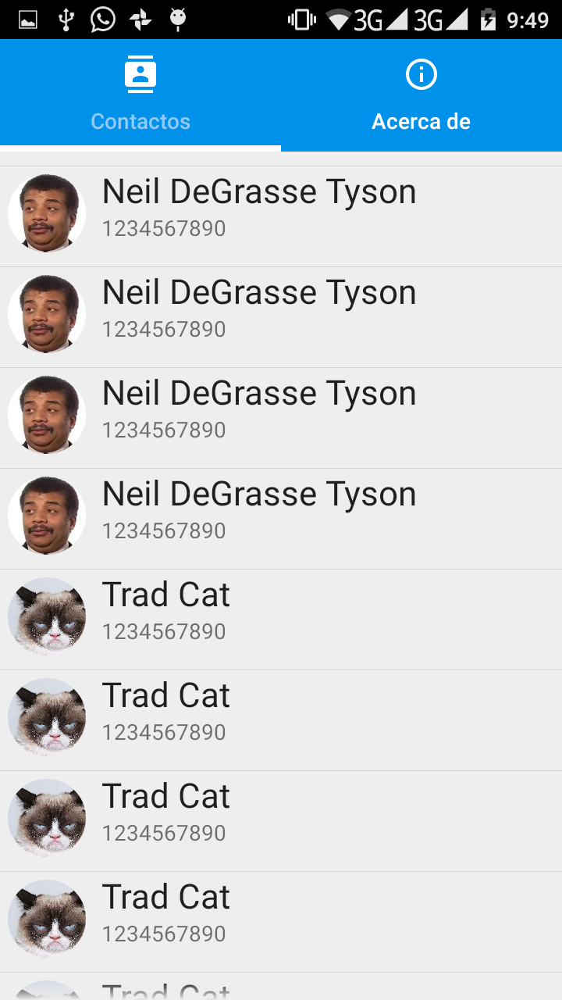
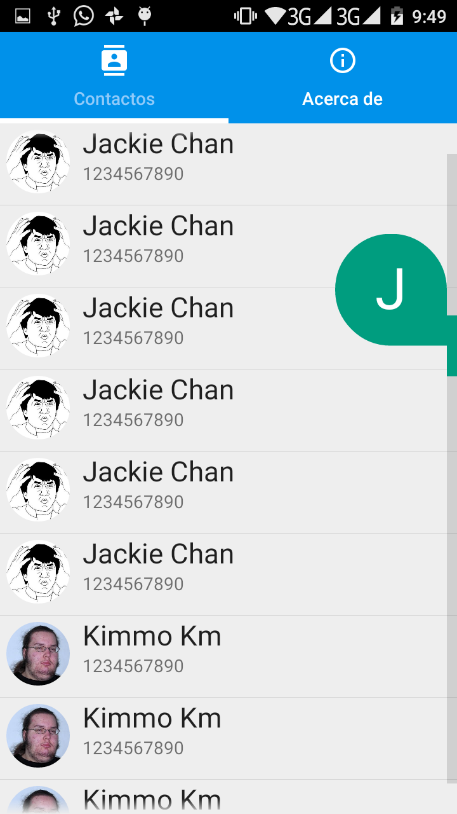
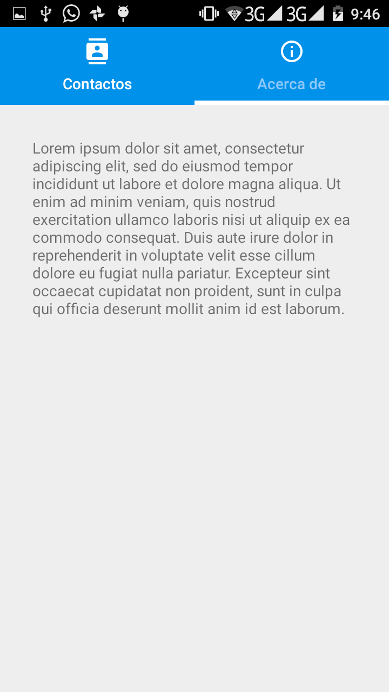
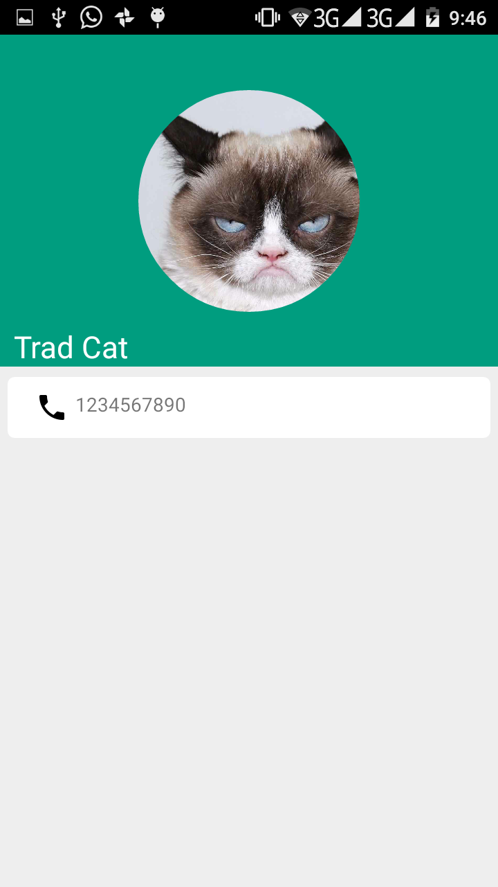
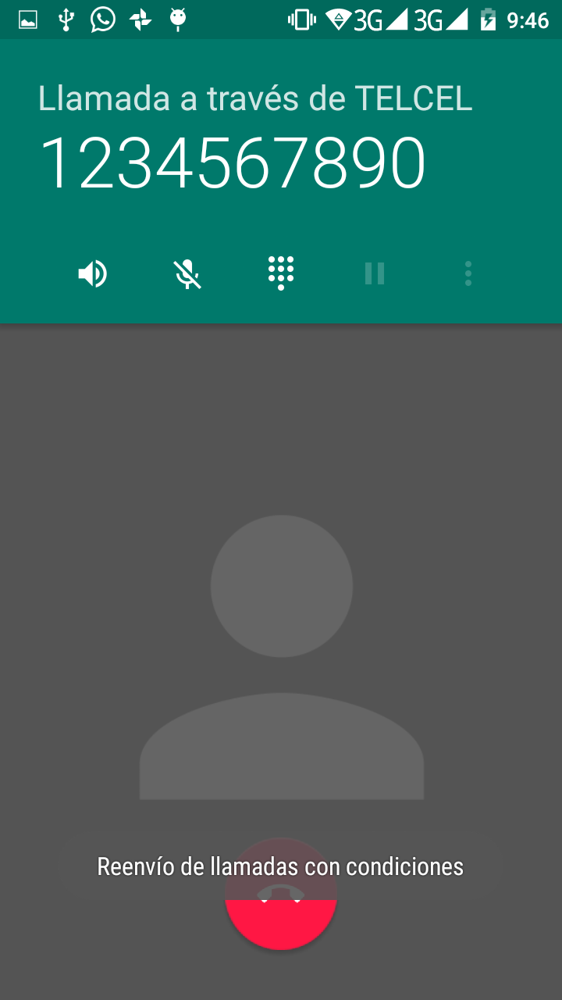

# Contactos
Practica del Curso Xamarin.Android impartido en la Universidad Politecnica de Chiapas

## Screenshoots

 |
 
 
 

## Informacion

El codigo del proyecto se encuentra sobre la rama develop, se usaron los temas vistos los dias Viernes y Sabado, los cuales fueron:
- Getting Started with Xamarin
- Introduction to Xamarin.Android
- Activities e Intents
- ListView and Adapters in Android
- Android Navigation

Nos falto revisar el tema **Toolbar and App Bar** por lo que podriamos complementar la app añadiendo una toolbar en la pantalla de detalle del item.

## Extras

Dentro de las cosas extras que podemos agregar a nuestra app para complementarla podria ser

- Agregar un [Splash](https://developer.xamarin.com/guides/android/user_interface/splash-screen/)
- En la Pantalla principal agregar un [Floating Action Button](https://material.io/guidelines/components/buttons-floating-action-button.html#) para agregar contactos
- Pantalla para agregar contactos con 
  - 1 EditText para agregar el nombre
  - 1 EditText para agregar el telefono 
  - 1 Button que nos permita abrir la [Camara del dispositivo](https://developer.xamarin.com/recipes/android/other_ux/camera_intent/take_a_picture_and_save_using_camera_app/) y tomar una imagen para luego visualizarla en un ImageView
  - 1 Button que nos permita abrir la [Galeria de imagenes](https://developer.xamarin.com/recipes/android/data/files/selecting_a_gallery_image/) y seleccionar una imagen para luego visualizarla en un ImageView
- Toolbar en la pantalla de detalle con una opcion que nos permita marcar un contacto como favorito (*Ver el material del tema **Toolbar and App Bar***)
- Toolbar con cuadro de busqueda en la pantalla de contactos que nos permita filtrar los contactos por nombre (*Ver el material del tema **Toolbar and App Bar***)
- Agregar una tab con el texto *Favoritos* que nos filtre los contactos marcados como favoritos (*Ver el material del tema **Android Navigation***)

## Recursos

- [Documentacion de Android](https://developer.android.com)
- [Documentacion de Xamarin Android](https://developer.xamarin.com/recipes/android/)
- [Iconos](https://material.io/icons/)
- [Generar iconos para una app a partir de una imagen](https://makeappicon.com/)
- [Otros componentes para android](https://material.io/components/android/catalog/)

